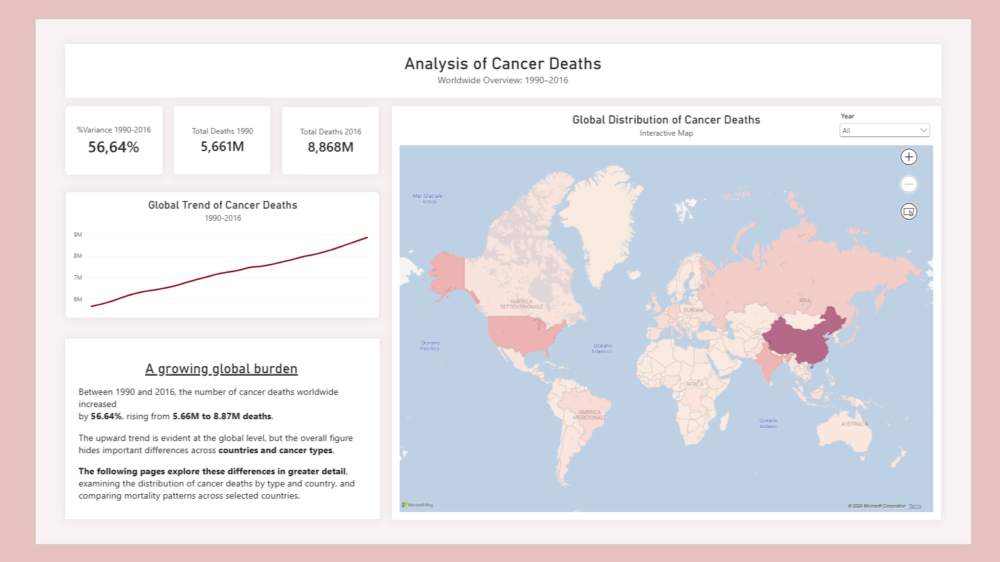
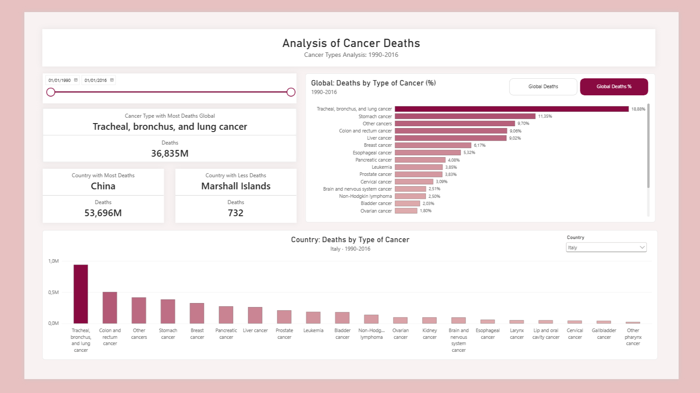
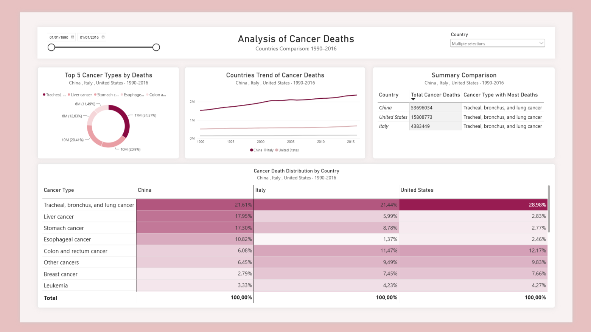

# Cancer Deaths Analysis

## Overview

This project analyzes the global burden of cancer deaths between **1990
and 2016**, with a focus on:

-   the evolution of total cancer deaths over time;
-   the distribution of deaths across cancer types;
-   differences between countries;
-   comparisons between selected countries and the global picture.

The project combines **Excel, Power Query, data modeling, DAX and Power
BI** to move from the original dataset to an interactive analytical
dashboard.

------------------------------------------------------------------------

# Dashboard Preview

### Worldwide Overview



### Cancer Types Analysis



### Country Comparison



------------------------------------------------------------------------

## Project Objectives

The analysis was developed around three main questions:

1.  **How did cancer deaths change worldwide between 1990 and 2016?**
2.  **Which cancer types account for the largest share of deaths
    globally and within selected countries?**
3.  **How do selected countries differ in their cancer-death patterns?**

The Power BI report is therefore organized into three analytical levels:

**Worldwide overview → Cancer type analysis → Country comparison**

------------------------------------------------------------------------

## Dataset

The source data are based on the **Our World in Data cancer deaths by
type** dataset, based on estimates from the **Institute for Health
Metrics and Evaluation (IHME), Global Burden of Disease (GBD)**.

The analysis uses data covering:

-   **1990--2016**
-   **204 countries/entities in the country reference table**
-   **20 cancer types**
-   annual counts of cancer deaths

The project focuses on **absolute numbers of deaths**, rather than
age-standardized mortality rates.

> Because the analysis uses absolute death counts, changes over time can
> reflect population growth and population aging as well as changes in
> mortality.

Source: [Our World in Data -- Cancer](https://ourworldindata.org/cancer)

------------------------------------------------------------------------

# Data Preparation

## 1. Excel

Excel was used as the initial environment for inspecting, organizing and
validating the dataset.

The original workbook contained a wide-format table where each row
represented an entity and year, while cancer types were stored as
separate columns.

The workbook was progressively reorganized into analytical tables,
including:

-   `Years_ID`
-   `Countries_ID`
-   `Type_of_cancer_ID`
-   `World_cancer_deaths`
-   `Countries_cancer_deaths`
-   `Complete_cancer_deaths`

Additional Pivot Tables were created in Excel to validate the results
and explore:

-   the percentage distribution of cancer types;
-   year-over-year variation in cancer deaths;
-   comparisons between Italy and the global total.

### Wide-to-long transformation

One of the main data preparation steps was transforming the original
wide dataset into a **long format**.

Instead of having one column for every cancer type, the analytical
structure uses:

  Country         Year Cancer Type       Total
  ------------- ------ --------------- -------
  Afghanistan     1990 Lung cancer         797
  Afghanistan     1990 Breast cancer       767
  Afghanistan     1990 Leukemia            728

This structure is better suited to Power BI because cancer type becomes
a dimension that can be dynamically filtered, grouped and compared.

------------------------------------------------------------------------

## 2. Power Query

Power Query was used to create a cleaner analytical dataset before
loading the data into the Power BI model.

Main transformations included:

-   importing the raw dataset;
-   restructuring the data from wide to long format;
-   standardizing column names and data types;
-   preparing country, year and cancer-type reference tables;
-   separating global and country-level data;
-   filtering out non-country aggregate entities where appropriate;
-   handling missing values and data-quality issues;
-   preparing the final tables used by the Power BI model.

The resulting structure follows a simplified:

**Raw → Transform → Model → Analysis**

workflow.

------------------------------------------------------------------------

# Data Model

The Power BI model uses separate reference tables for the main
dimensions:

-   `Countries_ID`
-   `Years_ID`
-   `Type_of_cancer_ID`

and analytical fact tables containing cancer-death observations.

The main country-level fact table is:

`Countries_cancer_deaths`

with the structure:

``` text
Country
Year
Type_cancer
Total
```

A separate table, `World_cancer_deaths`, is used for the worldwide
analysis.

A dedicated **Measures table** was also created in Power BI to keep DAX
calculations organized.

------------------------------------------------------------------------

# DAX Measures

DAX was used to create reusable calculations for the dashboard rather
than relying only on implicit aggregations.

Examples include:

-   total cancer deaths;
-   cancer deaths in 1990 and 2016;
-   percentage change between 1990 and 2016;
-   cancer type with the highest number of deaths;
-   country with the highest number of deaths;
-   country with the lowest number of deaths;
-   percentage contribution of each cancer type;
-   dynamic year labels;
-   dynamic country/year titles.

For example, the global percentage change between 1990 and 2016 is
calculated as:

``` dax
% Change 1990-2016 =
DIVIDE(
    [Total Deaths 2016] - [Total Deaths 1990],
    [Total Deaths 1990]
)
```

The analysis shows an increase from approximately:

-   **5.66 million deaths in 1990**
-   **8.87 million deaths in 2016**

corresponding to a **56.64% increase in the absolute number of cancer
deaths**.

------------------------------------------------------------------------

# Power BI Dashboard

The final Power BI report is divided into three pages.

## 1. Worldwide Overview

The first page provides a high-level view of the global situation
between 1990 and 2016.

It includes:

-   total cancer deaths in 1990;
-   total cancer deaths in 2016;
-   percentage change;
-   global trend over time;
-   geographical distribution through a filled map;
-   a short narrative explaining the main finding.

### Main result

The number of cancer deaths worldwide increased by **56.64%**, from
approximately **5.66M to 8.87M deaths** between 1990 and 2016.

The map and trend visualization provide the global context before moving
to cancer-type and country-level analysis.

------------------------------------------------------------------------

## 2. Cancer Types Analysis

The second page focuses on the distribution of cancer deaths across
cancer types.

The dashboard allows the user to:

-   change the selected time period;
-   view the global distribution by cancer type;
-   switch between absolute deaths and percentage contribution;
-   identify the cancer type with the highest number of deaths globally;
-   identify the country with the highest and lowest total number of
    deaths;
-   select a country and compare its cancer-type distribution with the
    global picture.

For the selected period, **tracheal, bronchus, and lung cancer**
represents the largest cancer category in the global dataset.

The country-level chart makes it possible to see how the distribution
changes when moving from the global level to an individual country.

------------------------------------------------------------------------

## 3. Country Comparison

The third page is designed for direct comparison between selected
countries.

Users can select multiple countries and examine:

-   the trend in total cancer deaths;
-   the top cancer types by deaths;
-   total cancer deaths by country;
-   the cancer type with the highest number of deaths for each selected
    country;
-   the relative contribution of cancer types within each country.

A conditional-formatting matrix is used to create a heatmap-style
comparison of the percentage distribution of cancer types across
countries.

This allows the comparison to focus on the **composition of cancer
deaths within each country**, rather than simply highlighting countries
with larger populations.

------------------------------------------------------------------------

# Key Insights

### Global trend

Cancer deaths increased substantially in absolute terms between 1990 and
2016:

**5.66M → 8.87M deaths (+56.64%)**

### Cancer type

Tracheal, bronchus, and lung cancer is the leading cancer category in
the analyzed global dataset over the selected period.

### Country differences

The dashboard highlights substantial differences in the composition of
cancer deaths between countries.

For example, the country comparison page allows the user to observe how
the relative contribution of individual cancer types changes between
**China, Italy and the United States**.

------------------------------------------------------------------------

# Excel Analysis

Excel was not used only as an intermediate file format.

It was also used for exploratory analysis and validation through Pivot
Tables.

Examples include:

### Cancer type distribution

A Pivot Table was created to compare cancer deaths by type for:

-   Italy
-   World

including both absolute deaths and percentage contribution to the
respective total.

### Year-over-year analysis

A separate Pivot Table and chart were used to analyze the year-over-year
percentage change in cancer deaths for Italy and the World.

This provided an additional validation layer before building the Power
BI dashboard.

------------------------------------------------------------------------

# Tools & Technologies

  -----------------------------------------------------------------------
  Tool                                Purpose
  ----------------------------------- -----------------------------------
  **Microsoft Excel**                 Initial data inspection, Pivot
                                      Tables and validation

  **Power Query**                     Data transformation and preparation

  **Power BI**                        Data modeling, visualization and
                                      dashboard

  **DAX**                             Measures and dynamic analytical
                                      calculations

  **Git / GitHub**                    Version control and project
                                      documentation
  -----------------------------------------------------------------------

------------------------------------------------------------------------

# Project Structure

``` text
Cancer_deaths_analysis/
│
├── .git/
├── .gitignore
│
├── Data/
│   └── Raw/
│       └── Cancer deaths grouped - OWID based on...
│
├── Docs/
│   └── images/
│       ├── worldwide-overview.png
│       ├── cancer-types-analysis.png
│       └── country-comparison.png
│
├── Country_cancer_deaths.xlsx
├── Dashboard_cancer_deaths.pbix
└── README.md
```

The raw dataset is kept separately from the analytical workbook and
Power BI report.

------------------------------------------------------------------------

# Methodological Notes

## Absolute deaths vs mortality rates

This project primarily analyzes **counts of deaths**.

Therefore, a country with a larger population can naturally have a
larger number of deaths even if its mortality rate is lower.

The dashboard should therefore be interpreted as an analysis of the
**number and distribution of cancer deaths**, not as a direct ranking of
cancer risk between populations.

## Percentage distributions

Where the dashboard uses percentages, the percentage represents the
share of a country's total cancer deaths attributable to a given cancer
type during the selected period.

This normalization is particularly useful for comparing the
**composition** of cancer mortality across countries with very different
population sizes.

## Time filters

Most Power BI visuals are controlled by a shared year selection,
allowing the user to analyze either the complete 1990--2016 period or a
selected time range.

------------------------------------------------------------------------

# Reproducibility

To explore the project:

1.  If necessary, update the source path used by Power Query.
2.  Refresh the Power BI model.
3.  Explore `Country_cancer_deaths.xlsx` to inspect the prepared Excel
    analysis and, with Power BI (`Dashboard_cancer_deaths.pbix`), the three dashboard pages 
    using the year and country filters.

------------------------------------------------------------------------

# Conclusion

This project combines spreadsheet analysis, data transformation,
dimensional modeling, DAX and interactive visualization to investigate
cancer mortality patterns between 1990 and 2016.

The analytical workflow moves from:

**Raw data → Excel exploration → Power Query transformation → Data model
→ DAX → Power BI dashboard**

with the goal of making the analysis both reproducible and
understandable from a business/data-analysis perspective.
